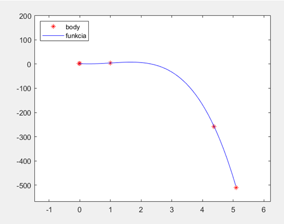
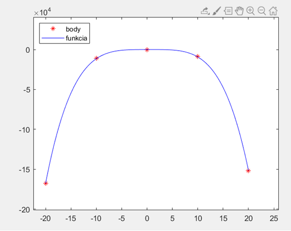
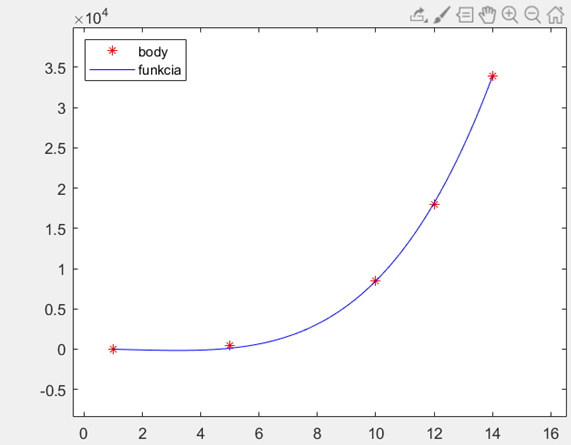

# Polynomial-Regression
Uses a genetic algorithm aproach to find a polynomial function from an inputted set of points.

Written in Matlab.

---

**An algorithm is as follows**:
1. Get an input from user (X and Y points). Genetic algorithm will then use these points to calculate a fitness function.
2. Generate random population with N size. This population represents the coefficients of the polynomial we are trying to find.
3. Calculate the fitness function - input X into each polynomial which will get us Y and compare the difference between these values and inputted Y values. (mean absolute error)
4. Pick K best from N population
5. Mutate and generate new pop from the rest (N-K)
6. Repeat

---

**Polynomial regression from inputted set of points**:
> Legend: points in red are user inputted X and Y values, blue is our approximated polynomial function.

